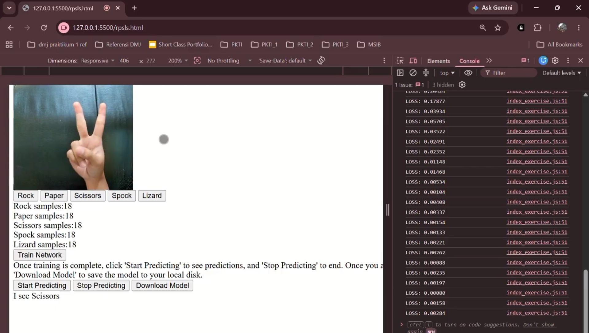

# 🪨📄✂️🖖🦎 Rock Paper Scissors Lizard Spock — Webcam Classifier

Real-time hand gesture classifier menggunakan **TensorFlow.js** dan **Transfer Learning** dari MobileNet, langsung berjalan di browser dengan input dari webcam. Project ini bisa mengenali 5 gestur: Rock, Paper, Scissors, Spock, dan Lizard.



## 🎥 Watch Demo

[](PASTE_YOUTUBE_LINK)

> Klik badge di atas untuk lihat demo project ini secara langsung.

---

## 📋 Deskripsi

Project ini adalah aplikasi **computer vision berbasis browser** yang memanfaatkan webcam untuk mengumpulkan data gambar secara real-time, lalu melatih neural network kecil (di atas fitur dari MobileNet) untuk mengenali gestur tangan Rock-Paper-Scissors-Lizard-Spock. Semua proses — mulai dari pengambilan data, training, hingga prediksi — berjalan **sepenuhnya di sisi client (browser)**, tanpa backend server, menggunakan [TensorFlow.js](https://www.tensorflow.org/js).

Konsep ini menggunakan pendekatan **Transfer Learning**: model MobileNet yang sudah dilatih sebelumnya (pre-trained) digunakan sebagai *feature extractor*, lalu di atasnya ditambahkan layer klasifikasi sederhana yang dilatih ulang (fine-tuned) dengan data gestur tangan milik kita sendiri.

## ✨ Fitur

- 📷 Live webcam feed langsung di browser
- 🖐️ Pengumpulan sample gambar untuk 5 kelas gestur (Rock, Paper, Scissors, Spock, Lizard)
- 🧠 Transfer learning menggunakan MobileNet sebagai base model
- ⚡ Training model dilakukan langsung di browser (client-side)
- 🔮 Prediksi real-time terhadap gestur yang ditunjukkan ke kamera
- 💾 Model hasil training bisa diunduh (download) ke local disk

## 🛠️ Tech Stack

- [TensorFlow.js](https://www.tensorflow.org/js) — machine learning di browser
- MobileNet v1.0 (224x224) — pre-trained model untuk feature extraction
- Vanilla JavaScript (tanpa framework)
- HTML5 `<video>` API untuk akses webcam

## 📂 Struktur Project

```
├── rpsls.html            # halaman utama, entry point aplikasi
├── index_exercise.js     # logic utama: training, prediksi, handle tombol
├── webcam.js             # wrapper class untuk capture frame dari webcam
├── rps-dataset.js         # class untuk menyimpan & mengelola dataset gambar
└── README.md
```

## 🚀 Cara Menjalankan

Project ini **tidak bisa dibuka langsung** dengan cara klik dua kali file HTML, karena browser modern membutuhkan koneksi `localhost` atau `HTTPS` untuk mengizinkan akses webcam (`getUserMedia`). Kamu perlu menjalankannya lewat local server.

### 1. Clone repo ini

```bash
git clone https://github.com/USERNAME_KAMU/NAMA_REPO.git
cd NAMA_REPO
```

### 2. Jalankan local server

Pilih salah satu cara berikut:

**Menggunakan Python:**
```bash
python3 -m http.server 8000
```
Lalu buka `http://localhost:8000/rpsls.html` di browser.

**Menggunakan Node.js:**
```bash
npx serve .
```
Lalu buka link yang muncul di terminal (biasanya `http://localhost:3000`).

**Menggunakan VS Code:**
Install extension **Live Server**, klik kanan pada `rpsls.html` → **Open with Live Server**.

### 3. Izinkan akses kamera

Browser akan meminta izin akses webcam — klik **Allow/Izinkan**.

## 🎮 Cara Pakai

1. **Kumpulkan data**: Tunjukkan gestur tangan ke kamera (misal Rock), lalu klik tombol **"Rock"** berkali-kali (disarankan 50+ klik per gestur, dengan sedikit variasi posisi/sudut tangan). Ulangi untuk Paper, Scissors, Spock, dan Lizard. Counter di bawah tiap tombol akan menunjukkan jumlah sample yang sudah diambil.
2. **Training**: Setelah data terkumpul untuk semua 5 gestur, klik **"Train Network"**. Tunggu hingga muncul alert **"Training Done!"**.
3. **Prediksi**: Klik **"Start Predicting"** untuk mulai deteksi real-time. Tunjukkan gestur ke kamera, hasil prediksi akan muncul sebagai teks (misal "I see Rock").
4. Klik **"Stop Predicting"** untuk menghentikan prediksi.
5. **Simpan model**: Klik **"Download Model"** untuk mengunduh model hasil training ke komputer kamu.

> ⚠️ **Catatan**: Aplikasi ini **tidak otomatis** mendeteksi gestur begitu kamera menyala. User perlu melalui proses pengumpulan data dan training terlebih dahulu sebelum prediksi bisa berjalan.

## 📄 License

Project ini menggunakan komponen dari TensorFlow.js examples yang dilisensikan di bawah [Apache License 2.0](http://www.apache.org/licenses/LICENSE-2.0).
